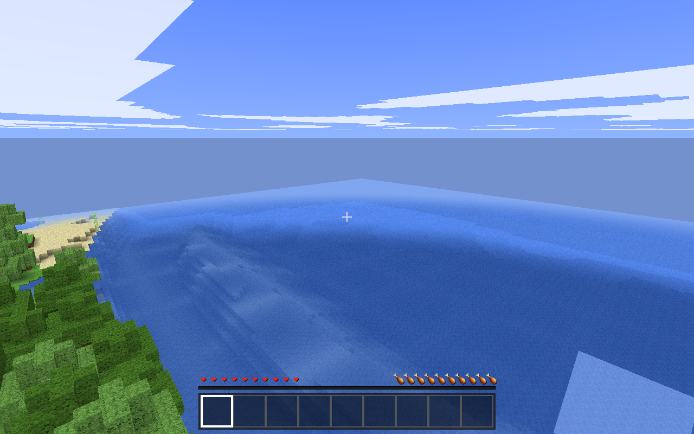

# VoxelCraft

A faithful single-player recreation of Minecraft's full survival loop, built **from
scratch in the browser** — vanilla JavaScript + [three.js](https://threejs.org),
no game engine, no physics library, no asset files. Every texture is generated
procedurally at runtime.



## Play

- **Web**: deployed on Vercel from this repo (auto-deploys from `main`)
- **Local**:

```bash
npm install
npm run dev        # → http://localhost:5173
```

Click **New World**, then click the screen to grab the mouse. Your world
autosaves to the browser's IndexedDB every 30 seconds — close the tab and
**Continue World** picks up where you left off.

## Controls

| Input | Action |
|---|---|
| Mouse | Look |
| W A S D | Move · double-tap **W** to sprint |
| Space / Shift | Jump / sneak (sneaking won't fall off edges) |
| Left-click (hold) | Mine / attack |
| Right-click | Place block · use item · open chests, crafting, doors, beds |
| 1–9 / wheel | Hotbar |
| E | Inventory (2×2 crafting grid) |
| Q / Shift+Q | Drop item / stack |
| Esc | Pause (autosaves) |
| F3 | Debug overlay |
| F4 | Debug creative: flight (double-tap Space), instant break, item palette |

## Features

- **Infinite deterministic worlds** — 11 biomes, caves & ravines, rivers and
  oceans, ore veins at authentic depths, trees, villagesless wilderness. Same
  seed ⇒ same world, generated in a web worker at ~3 ms/chunk.
- **Java-accurate mechanics** — movement speeds (4.317 walk / 5.612 sprint m/s),
  mining times per tool tier, the 1.9 attack-cooldown combat system, armor
  math, hunger/saturation/exhaustion, XP levels, fall damage, drowning.
- **Full lighting engine** — per-voxel sky + block light BFS with smooth
  per-vertex lighting and ambient occlusion; torches flood caves, day/night
  never remeshes a chunk.
- **9 mobs** — zombies, skeletons (strafing archers), creepers, spiders
  (wall-climbing, light-gated), endermen (stare provocation, teleports), plus
  breedable cows/pigs/sheep/chickens — goal-based AI with A* pathfinding.
- **Survival loop** — punch trees → craft tools → mine ores → smelt iron →
  build a shelter → farm wheat → fight the night → sleep in a bed → respawn.
- **Blocks with behavior** — flowing water & lava (obsidian/cobblestone
  interactions), falling sand, TNT chain explosions, farmland & crops, doors,
  furnaces, chests, saplings that grow real trees, grass spread, leaf decay,
  snow and ice in cold biomes, weather with lightning.
- **20 TPS fixed-timestep** simulation with interpolated rendering; 60+ fps at
  render distance 8.

## How it's built

| Layer | Approach |
|---|---|
| Rendering | three.js `WebGLRenderer`, 3 shared shader materials for all chunks, culled-face meshing with per-vertex AO/light |
| Textures | One 512×512 atlas, all 197 tiles painted onto a canvas at startup (zero image requests) |
| Worldgen | Seeded simplex-noise stack in a worker; chunks are pure functions of `(seed, cx, cz)` |
| Physics | Axis-separated AABB vs voxel grid, swept collision |
| Persistence | IndexedDB — only modified chunks are saved; the seed regenerates the rest |
| Specs | The entire game was implemented from six frozen spec documents (preserved in git history); deviations are logged in [DEVIATIONS.md](DEVIATIONS.md) |

## Additions log

*This section is updated as new features land.*

- **2026-07-17** — Audio integration audit (`UPDATE-audio-not-playing-fix`):
  re-verified the whole E1 chain against the **real** browser autoplay policy
  (suspended → running on a genuine gesture, audio flowing immediately) and
  against the production build (walking produces synthesized footsteps, zero
  audio requests). Fixed one real hole: `musicMode: "Menu + gameplay"` with no
  cleared theme tracks suspended the synth composer without anything to replace
  it — silence in every shipped build. The composer is now the fallback §16
  mandates, so music always plays with zero assets.
- **2026-07-17** — **Audio (expansion phase E1, `16-AUDIO`)**: a full Web Audio
  layer, **100 % synthesized at runtime — zero sample files, zero audio
  downloads**. Every sound is built from oscillators, noise and math: a boot-time
  buffer bakery (pink/brown/impulse beds, baked Karplus–Strong plucks, seamless
  ambience loops — 3.6 MB, seeded so it sounds identical every run), 11 synth
  primitives, and a master event registry covering block step/dig/break/place for
  12 material classes, player hurt/fall/eat/XP, nine mob voices with idle
  cadence, explosions that muffle with distance, weather, and fluid-cluster
  ambience. Positional audio via a 32-voice pool with priority stealing and
  per-event caps; an all-original generative composer (seeded random walks over
  scale tables — the same world always replays the same piece); and an Options
  screen reachable from the title *and* pause with five bus sliders, theme-music
  mode, mouse sensitivity and view bobbing (the last two were previously stored
  but unread). Audio costs ~0.015 ms/frame typical against a 1.5 ms budget.
- **2026-07-17** — Main menu + menu music: desert/badlands-sunset title screen
  (animated CSS scene, ClaudeCraft wordmark, version badge, PRESS START →
  New Game / Continue / Settings / Quit on the supplied art, self-hosted OFL
  fonts, reduced-motion aware), a settings panel with live-persisted Master /
  Music / SFX sliders, and the 16-AUDIO §4A theme-music player (shuffled, no
  immediate repeats, RAM-guarded preload, 1.5 s/0.8 s fades, 10–20 s gaps,
  gesture-started, fades out on world load). Renamed VoxelCraft → ClaudeCraft.
  **Menu tracks are gated:** the C418 files in `CC-assets/CC-sounds/` are local
  dev placeholders that can never reach a build — see DEVIATIONS.md "Audio
  copyright ship-gate" before shipping music.
- **2026-07-17** — Sky/sun render fix: sun, moon and sunset band now depth-test
  against terrain (leaves/hills occlude them; the "grey blob at spawn" was the
  moon drawing through the ground), horizon visibility gates at `dir.y > −0.3`,
  the sun dims and warms through dusk via the §6 `sunIntensity` curve and the
  sunset-band window, soft zero-edge sun texture (no more hard square), moon
  alpha scales with phase and the new-moon cell is 25 % alpha per spec.
- **2026-07-17** — Crafting/inventory UI overhaul: canonical 176×166 GUI-px
  layout (armor / player preview / offhand / 2×2 grid / arrow / result), fixed
  shaped-recipe matching (pattern bounding-box trim — axes and hoes craft now,
  recipes match at any grid offset and mirrored), offhand slot 45 with F-swap
  and left-hand rendering.
- **2026-07-17** — Mouse look fix: pointer-lock deltas now drive the camera
  (0.15°/count, ±90° pitch clamp).
- **2026-07-17** — Performance: chunk-lookup caching in the lighting/world hot
  paths; worst tick 29 ms → 8.7 ms.
- **2026-07-16** — Initial complete build: worldgen, engine, player, mobs,
  combat, lighting, day/night & weather, crafting/smelting, hunger/XP,
  save/load — verified against the specs' acceptance checklists headlessly.

## Out of scope (by design)

Redstone circuits, enchanting, potions, the Nether/End, villages, multiplayer,
audio. See `CLAUDE.md` for the master plan and stretch goals.
